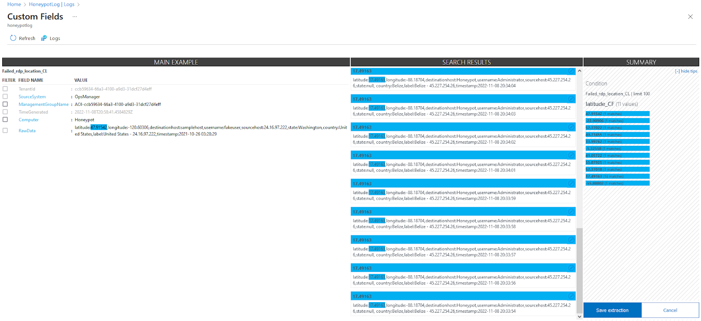

# Vulnerable-machine-lab
Create a vulnerable machine and locate attackers around the world.

### Technologies used:
- Azure
- Azure sentinel
- Powershell (script)
- ipgeolocation.io

## Virtual machine set-up
1) Once signed up/ logged in to Azure, create a Windows 10 Pro virtual machine and assign it to a resource group for this lab. (MAKE A NOTE OF USERNAME AND PASSWORD)
2) Proceed through set up and once at Networking, in "NIC network security group" click Advanced - Create New.
3) Remove any exisiting security groups and add an inobund rule as shown below. This increases the visability and vulnrability of the machine.

4) Finalize VM steps and wait for it to be created.

## Log Analytics set-up - this allows logs to be drawn from the VM.
1) Head to Log analytics within Azure - and create a new workspace.
2) Simply create the workspace and make sure it is linked to the same resource group you just created for the VM.
3) Within the left menu click Virtual Machines - Your VM - Connect to link your Log workspace to your VM.
4) Allow log gathering by heading to Microsoft Defender for the Cloud, - Pricing & settings - Your Log workspace - Turn on Azure defender.
5) Also enable data collection by Data collection - All events (check this box).

## Azure Sentinel set-up.
1) Within Azure, head to Microsoft Sentinel - Create - Click your Log workspace

## Geolocation API set-up.
1) Head to https://ipgeolocation.io/, make an account and paste you API key into the Powershell script attached to this repo.

---

## Putting it all together

### VM script config
1) Get your VM IP from the VM tab as shown below.
2) Use RDP on your own machine to log into the VM, using the IP provided and your name and password from the VM set up stage.
3) 
4) Head to Windows Firewall within the VM and turn OFF all firewall features, making it discoverable to others.
5) This lab focuses on using a failed log-in attempt to locate an attacker. This event has the Event ID of 4625 within Event Viewer.
6) Copy and paste the Custom_Security_Log_Exporter.ps1 script into the VM Desktop. Running the script in Powershell will provide the log of any attacker trying to log into the VM, providing their IP and the username they tried like so;
```
latitude:38.49290,longitude:102.19476,destinationhost:honeypot-vm,username:的用户帐户,sourcehost:61.178.82.2,state:null, country:China,label:China - 61.178.82.2,timestamp:2021-10-29 02:08:43
```
### Create custom log in Azure to display script results
1) Go to your Log workspace - Custom logs - Add - Copy and Paste sample data from the script provided - Give the rule a name and save.
2) The above is used to "train" the analytics feature to display the infomation from the script output.

4) Within Query you can search(Run) for results of the rule you just created to see results directly from the VM.

4) To extract data from results; right-click any result - extract field - highlight the RESULT of each desired field and give it a relevant name in "field_name". See below image or https://learn.microsoft.com/en-us/azure/azure-monitor/logs/custom-fields for help.

5) Repeat for each value of Latitude,Longitude, Destinaiton host, Username, Sourcehost, State, Country, Label and timestamp. This will give you a clean output of results and allow proper display on the map.

### Map display

1) Head to your log workspace in Sentinel - Workbooks - Add New - Remove anything inside.
2) Add query - ```YOUR_LOG_HERE_CF | summarize event_count=count() by sourcehost_CF, latitude_CF, longitude_CF, country_CF, label_CF, destinationhost_CF | where destinationhost_CF != "samplehost" | where sourcehost_CF != "" ```
3) Within Visualization, select Map. Feel free to edit the map view to suit your needs otherwise just fill in each field with the relevant field from your script results eg Latitude = latitude_CF , Metric Label = label_CF etc

## ALL DONE!

Running the script on your VM will now lead to results being displayed on a heatmap of the globe with an active count of failed RDP attempts by country.

